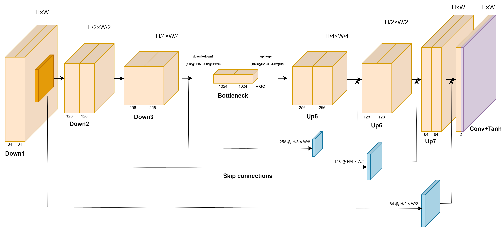
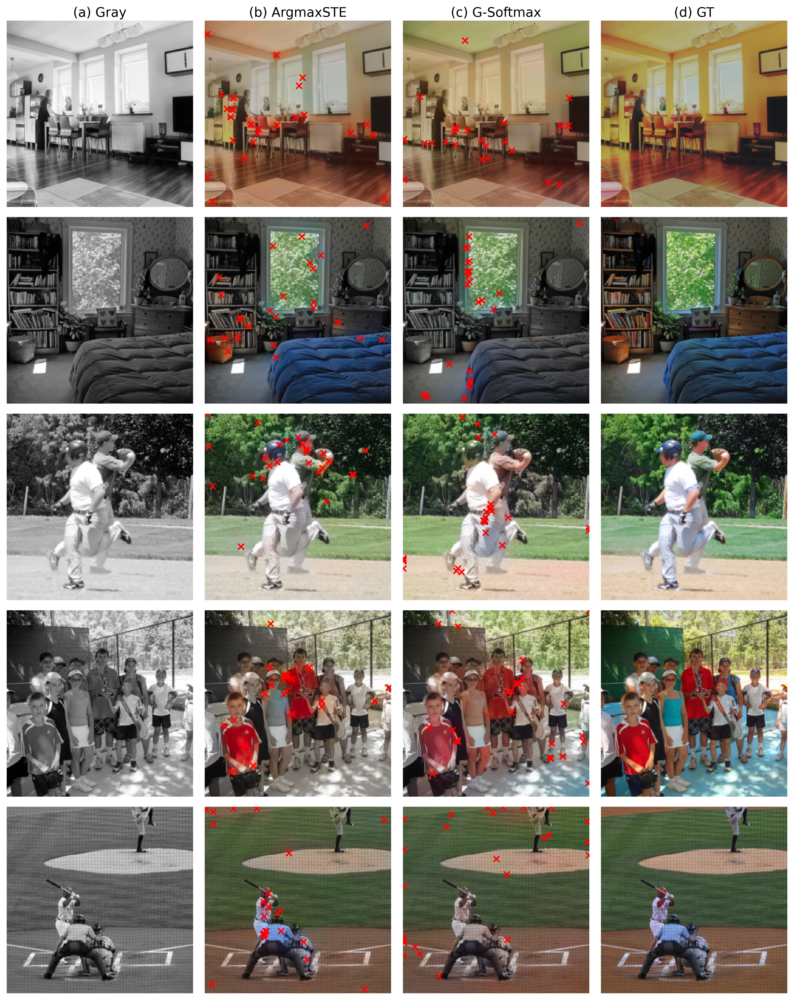
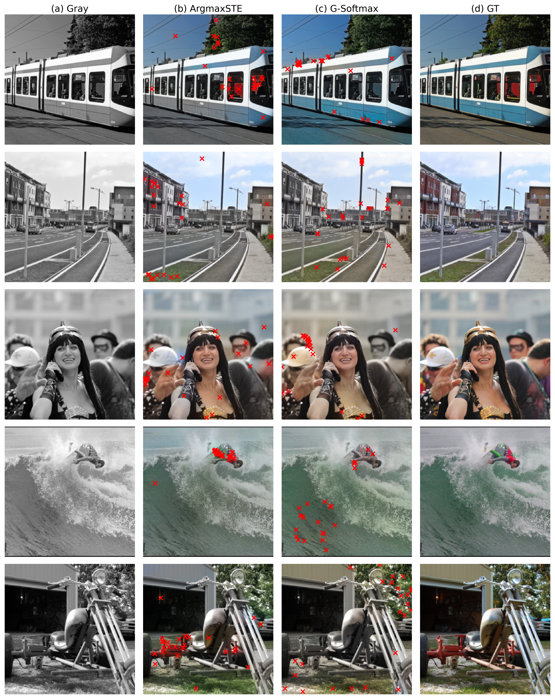

# User-Guided Interactive Colorization of Grayscale Images

## Overview

This project implements a user-guided interactive image colorization framework based on the MSc thesis "User-Guided Interactive Colorization Of Grayscale Images" by Ruida Jiang, Trinity College Dublin, July 2025. It combines:

- **ColorNet**: A U-Net based network that colorizes grayscale images using sparse user clicks and a squeeze-and-excitation bottleneck.
- **EditNet**: A lightweight U-Net that predicts optimal next click positions by analyzing the current colorization result, using gradient estimation techniques to maintain differentiability.

This dual-network collaboration significantly reduces user interactions while improving colorization quality.

## Installation

1. Clone this repository:

   ```bash
   git clone https://github.com/RJLante/Msc_project_colourisation.git
   ```

2. **Requirements**:

   - Python >= 3.8
   - PyTorch >= 1.10
   - torchvision
   - scikit-image
   - lpips
   - numpy, tqdm, matplotlib

## Data Preparation

1. Download COCO 2017 train and val sets:

   => Run `data/data.ipynb`

2. Ensure images are in RGB format; the dataset loader converts them to Lab internally.







`Gumbel-softmax` version saved at `src/gumber-softmax`

For detailed methodology and experiments, refer to the full thesis PDF in `docs/`.
